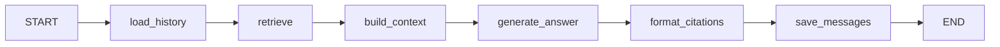
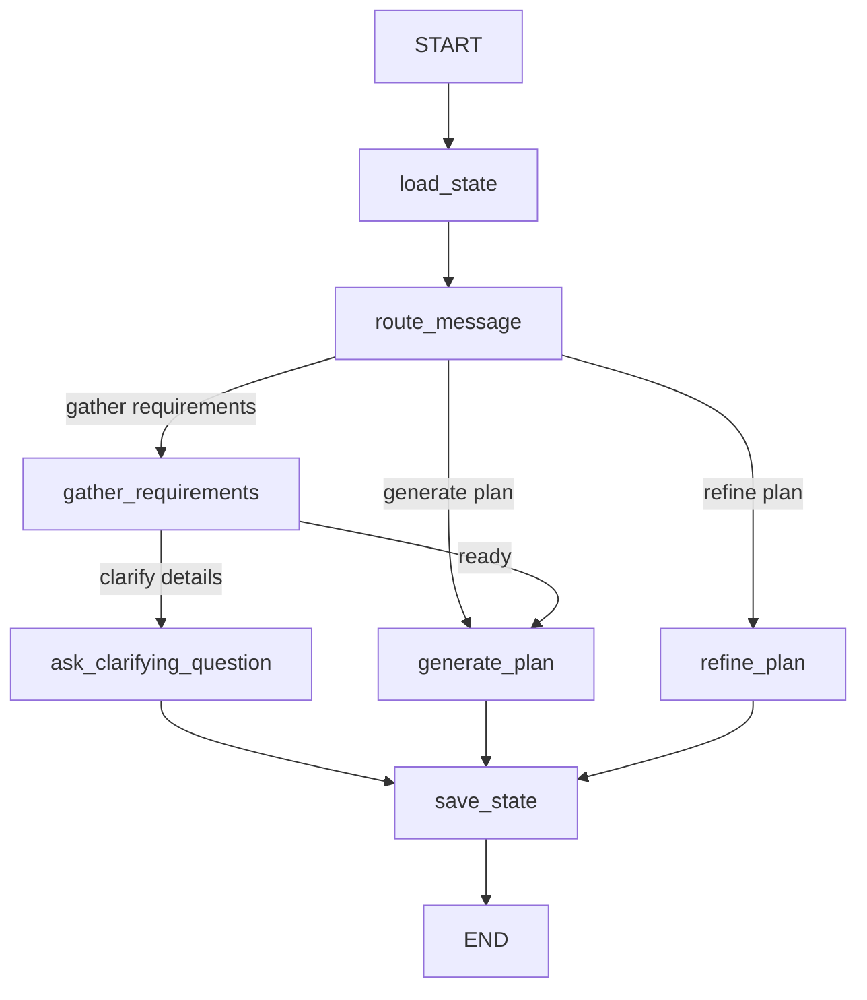

# SamaSocial AI Assistant

Multi-Source AI Learning Assistant (Task 1) and AI Course Planning Assistant (Task 2) — powered by **Gemini 2.5 Flash**, **LangGraph**, **Next.js 15 (Turbopack)**, and **Supabase (pgvector)**.

---

## Architecture

```
                                  +-----------------------+
                                  |   Next.js Frontend    |
                                  |     (Port 3000)       |
                                  +-----------+-----------+
                                              | (Rewrites /api/v1/*)
                                              v
                                  +-----------------------+
                                  |    FastAPI Backend    |
                                  |     (Port 8000)       |
                                  +-----+-----------+-----+
                                        |           |
               +------------------------+           +------------------------+
               | (Embeddings & Retrievals)                                   | (Orchestration & Refinements)
               v                                                             v
+------------------------------+                              +------------------------------+
|       Supabase DB            |                              |          LangGraph           |
| (Vector Indexes & Tables)    |                              |   (Learning & Course Graph)  |
+------------------------------+                              +--------------+---------------+
                                                                             |
                                                                             | (SSE Stream)
                                                                             v
                                                              +------------------------------+
                                                              |          OpenRouter          |
                                                              |     (Dual LLM Fallback)      |
                                                              +------------------------------+
```

### LangGraph Workflow Designs

#### Task 1: Multi-Source Learning Assistant RAG


#### Task 2: AI Course Planning Assistant


---

## Features

### 🌟 Task 1: Learning Assistant (RAG)
* **Multi-Source Ingestion**: Supports uploading local PDFs and PowerPoint presentations, or scraping from YouTube transcripts and Websites.
- **Smart Chunking & Embeddings**: Content parsed, chunked with overlap limits, and indexed inside Supabase `pgvector` index using `gemini-embedding-001` (3072 dimensions).
- **Source Citation Attributions**: Answers ground strictly inside the provided context. Every reference is parsed and dynamically rendered as clickable source tags (e.g. `PDF Page 3`, `at 03:22 in Video`).
- **SSE Token Streaming**: Answers stream in real-time.
- **Asynchronous Status Polling**: The frontend displays real-time parsing updates by active background polling.

### 🎓 Task 2: AI Course Planner
- **Guided Conversation Intake**: Friendly AI prompts gather course details: subject, audience, skill level, duration, frequency, and goals.
- **Visual Checklist**: Checks off requirements dynamically as details are provided.
- **Modular Preview**: A visual curriculum preview shows Modules, Expandable Lessons (with Objectives & Resources), Assignments, and Assessments.
- **Conversational Refinement**: Refine plans on the fly (e.g. `"make module 1 easier"`, `"add a capstone project"`).
- **Version Navigation**: Navigate back and forth between past plan versions.
- **curriculum Export**: Instantly export and download structured course plans as JSON.

---

## Setup & Configuration

### Prerequisites
- **Node.js** ≥ 18
- **Python** ≥ 3.11
- **Supabase** account with pgvector enabled

### Environment Configuration

#### Backend Environment (`backend/.env`)
Create `backend/.env` copying from `backend/.env.example`:
```ini
# Supabase Configuration
SUPABASE_URL=https://your-project.supabase.co
SUPABASE_SERVICE_KEY=your-supabase-service-role-key

# Google Gemini API
GOOGLE_API_KEY=your-google-ai-studio-api-key
GEMINI_CHAT_MODEL=gemini-2.5-flash
GEMINI_EMBEDDING_MODEL=gemini-embedding-001
EMBEDDING_DIMENSIONS=3072

# OpenRouter (Optional, Chat will fallback to direct Gemini if empty)
OPENROUTER_API_KEY=your-openrouter-key
OPENROUTER_CHAT_MODEL=google/gemini-2.5-flash
```

#### Frontend Environment (`frontend/.env.local`)
Next.js redirects all API calls starting with `/api/v1` to `http://localhost:8000/api/v1` automatically via rewrites. No additional environment parameters are required for local development.

---

## Installation

### 1. Database Migrations
1. Go to your **Supabase Dashboard** -> **SQL Editor**.
2. Copy and paste the contents of `supabase/migrations/001_initial_schema.sql`.
3. Click **Run**. This enables `vector`, sets up `sessions`, `messages`, `sources`, `chunks`, `course_plans`, and configures the cosine similarity RPC `match_chunks`.

### 2. Backend Installation
```bash
cd backend
python -m venv venv
venv\Scripts\activate      # On Windows
# source venv/bin/activate # On macOS/Linux
pip install -r requirements.txt
```

### 3. Frontend Installation
```bash
cd frontend
npm install
```

---

## Run Locally

```bash
# Terminal 1: Run Backend API
cd backend
venv\Scripts\activate
uvicorn backend.main:app --port 8000 --reload

# Terminal 2: Run Next.js Frontend
cd frontend
npm run dev
```

Open [http://localhost:3000](http://localhost:3000) on your browser.

---

## Verification & Testing

### 1. Verification Endpoints
Verify health check returns status `"healthy"`:
```bash
# Direct FastAPI health check
curl http://localhost:8000/api/v1/health

# Redirect rewrite check via Next.js port
curl http://localhost:3000/api/v1/health
```

### 2. Backend Automated Unit Tests
To run all 20 unit tests covering RAG pipeline nodes, parsing, requirement extractions, and routing rules:
```bash
cd backend
venv\Scripts\activate
python -m unittest backend.test_phase1 backend.test_phase3
```

---

## Project Structure

```
NAVgurukul/
├── backend/               # FastAPI Backend
│   ├── agents/            # LangGraph State-Graph workflows
│   │   ├── learning_graph.py  # Task 1 RAG workflow
│   │   └── course_graph.py    # Task 2 Planner workflow
│   ├── api/               # API router controllers
│   │   ├── chat.py        # Task 1 Chat Streaming router
│   │   ├── courses.py     # Task 2 Planner Streaming router
│   │   └── sources.py     # Document uploading parser router
│   ├── parsers/           # Local loaders (PDF, PPTX, Web, Youtube)
│   ├── rag/               # Retrieval vectors embeddings
│   ├── test_phase1.py     # Task 1 test suites
│   └── test_phase3.py     # Task 2 test suites
│
├── frontend/              # Next.js 15 App Workspace
│   ├── app/
│   │   ├── learning/      # Task 1 Assistant Page
│   │   └── courses/       # Task 2 Course Planner Page
│   ├── components/        # React Display Components
│   └── hooks/             # Custom streaming hooks
│
└── supabase/
    └── migrations/        # SQL schema migration models
```
